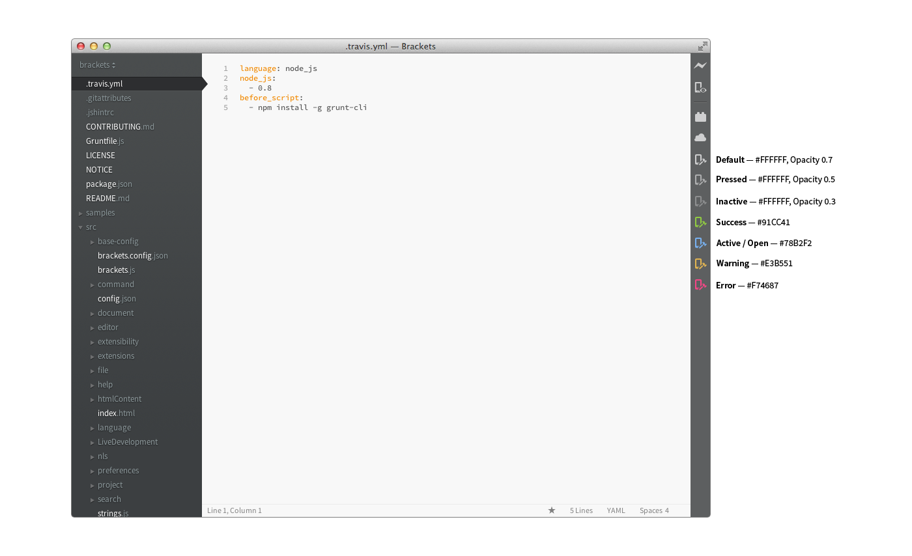

In Brackets, icons are used to:

* leverage globally understood visual concepts, or where icons usage is more conventional than text
* save space by using an easily understood symbol, where localization or text orientation is constrained
direct the user visually and break down or differentiate elements (i.e. feature lists)
* enforce consistency within the application
* make the interface visually engaging.

## Styleguide

* use simple shapes that are not too detailed, use as less anchor points as possible
* make sure it's flat i.e. without gradients, highlights, or shadows
* the corners are slightly rounded
* use thinner lines rather than thicker lines
* try to use SVG instead of PNG.

### Extension Icon Size  

* 24px by 24px
* for sprites use a 24x24 grid.

### Use Colors to Indicate Extension State

The icon should be #BBBBBB by default.

* inactive/disabled state has an opacity of 0.4 set in CSS on the default icon
* use green (#91cc41) for "everything is okay right now"/success state
* use blue (#78b2f2) for on/active state
* use yellow (#e3b551) for warning state
* use red (#f74687) for error state.

### Examples

* [Extension Manager Icon](icon-guidelines/topcoat-plugin-20.svg)
* [Device Preview Icon](icon-guidelines/topcoat-preview-20.svg)
* [Web Font Icon](icon-guidelines/topcoat-webfont-20.svg)

Ping @larz0 if you need help with your extension icon.